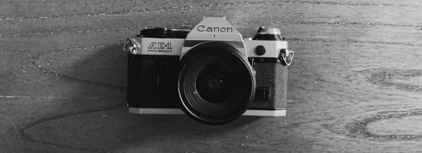

## Portfolio

---

### Personal Projects

### [Tattoo GAN](https://github.com/silkdom/Tattoo-GAN)

<meta property='og:title' content='Silkdom Portfolio'/>
<meta property='og:image' content='img/A.jpg'/>
<meta property='og:description' content='tbdz'/>
<meta property='og:image' content='https://silkdom.s3.us-east-2.amazonaws.com/A.png'/>

Using GANs to create tattoo design ideas. Write up TBC 22/6/2020

---
### [Deblur](https://github.com/silkdom/Deblur)

 

Fixing my crappy photography with neural networks, via implementation of DeblurGANv2 and PULSE architectures (with varying success..!). Then streamline DeblurGANv2 testing process into an easily executable Colab notebook format for accessible use.  

---
### [Corner Office](https://github.com/silkdom/Corner-Office)

Using selenium to automatically book the best study room in the Rotman building at 12:00:01 AM each day. 

---
### Academic Projects 

### [Thesis Publication (TaskGen)](https://github.com/silkdom/Thesis-Publication)

 

My thesis "A decision-support framework for techno-economic-sustainability assessment of resource recovery alternatives" has been published in the Journal of Cleaner Production. This repo regards the software implementation of the framework (TaskGen).

<meta property='og:image' content='https://silkdom.s3.us-east-2.amazonaws.com/A.png'/>

